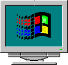

# Composition 98

This is a Piet program that looks like the Windows 98 logo and
prints out its version number when run.
This art project was created by Sampsa "Tuplanolla" Kiiskinen and
first published at the Instanssi 2024 demoparty
as an entry in the Summamutikka competition.

The program is in `npiet-program.png`.
Another version of the program with fewer modifications is
in `npiet-program-minimal.png`.
Execution of the program is illustrated in `npiet-trace.png`.
Instructions for compiling and executing the program are in `Makefile`.
An equivalent assembly program is in `npiet-plan.asm`.
Some scattered thoughts are in `notes.md`.
The legal code is in `LICENSE`.
You are now in `README.md`.
